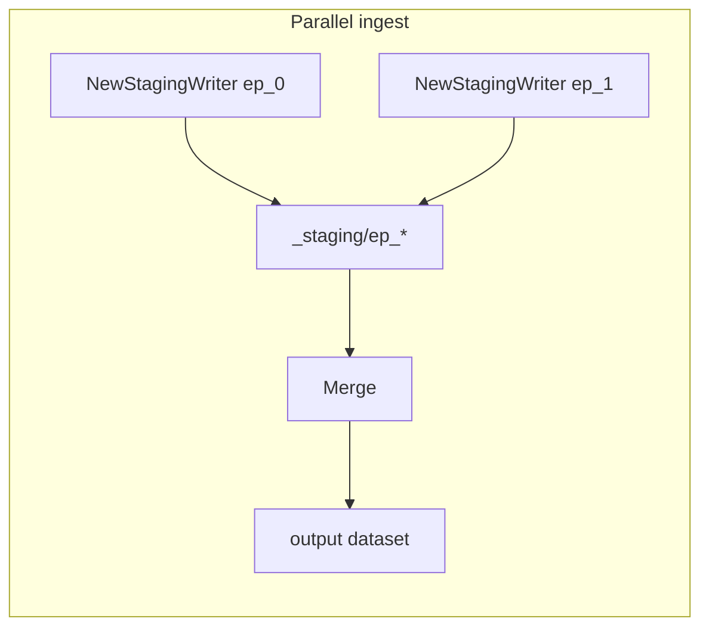

# API guide

Import path:

```go
import "github.com/ioai-tech/lerobot-go/lerobot"
```

Package docs: [pkg.go.dev/github.com/ioai-tech/lerobot-go/lerobot](https://pkg.go.dev/github.com/ioai-tech/lerobot-go/lerobot)

## Workflows

| Goal | API | CLI equivalent |
|------|-----|----------------|
| Parallel episode ingest | `NewStagingWriter` → `Merge` | `create` |
| Serial single-process write | `Create` → `Finalize` | — |
| Validate layout | `NewInspector` | `validate` |
| Bounded parallel jobs | `RunEpisodeJobs` | — |



## Types

### Version

- `lerobot.V21` — codebase v2.1
- `lerobot.V30` — codebase v3.0 (default when unset)

### FeatureSpec

Matches `meta/info.json` feature entries:

```go
features := map[string]lerobot.FeatureSpec{
    "observation.state": {DType: "float32", Shape: []int{7}},
    "action":            {DType: "float32", Shape: []int{7}},
    "observation.images.cam": {DType: "video", Shape: []int{480, 640, 3}},
}
```

- `DType: "video"` — mp4 sidecar (default v2.1 path); requires ffmpeg
- `DType: "image"` — embed image bytes in parquet (v2.1-img style)
- Set `UseVideos: true` on staging config when using video dtypes

### StatsMode

- `lerobot.StatsSampled` — official subsampling (default)
- `lerobot.StatsFull` — scan every frame for image/video stats

Set on `StagingConfig`, `MergeConfig`, and `CreateConfig`.

### FFmpegConfig

```go
FFmpeg: lerobot.FFmpegConfig{FFmpegPath: "/usr/bin/ffmpeg"}
```

Empty paths use `PATH` lookup.

### Temp frame staging

`CreateConfig` and `StagingConfig` also accept:

```go
TempRoot: "/dev/shm"
```

Behavior:

- when `TempRoot` is empty, the writer auto-detects a memory-backed temp root and prefers `/dev/shm` on Linux;
- if no writable memory filesystem is available, it falls back to disk-backed temp staging under the episode directory;
- embedded `dtype: "image"` features avoid temporary image files entirely and are kept in memory until parquet write;
- `dtype: "video"` requires `UseVideos: true`; invalid configs fail fast.

### Frame

```go
lerobot.Frame{
    Task: "pick", // maps to task_index
    Values: map[string]any{
        "observation.state": []float32{...},
        "action":            []float32{...},
    },
}
```

## Parallel staging + merge

Recommended for multi-episode pipelines (matches CLI `create`):

```go
ctx := context.Background()
features := map[string]lerobot.FeatureSpec{ /* ... */ }

// One goroutine per episode
w, err := lerobot.NewStagingWriter(ctx, lerobot.StagingConfig{
    Version:  lerobot.V30,
    Dir:      filepath.Join(stagingRoot, "ep_000000"),
    Episode:  0,
    TempRoot: "/dev/shm", // optional; empty uses auto-detect
    FPS:      30,
    Features: features,
    Stats:    lerobot.StatsSampled,
})
// w.AddFrame(ctx, frame) for each timestep
manifest, err := w.SaveEpisode(ctx)

err = lerobot.Merge(ctx, lerobot.MergeConfig{
    Version:     lerobot.V30,
    StagingRoot: stagingRoot,
    OutputRoot:  outputRoot,
    FPS:         30,
    Features:    features,
    Stats:       lerobot.StatsSampled,
})
```

Staging directories must be named `ep_NNNNNN` with a completed `episode_meta.json` per episode.

## Serial Create + Finalize

Convenience API for single-process writers. Staging lives under `Root/_staging` until `Finalize`:

```go
ds, err := lerobot.Create(ctx, lerobot.CreateConfig{
    Version:  lerobot.V30,
    Root:     "./dataset",
    TempRoot: "/dev/shm", // optional; empty uses auto-detect
    FPS:      30,
    Features: features,
    Stats:    lerobot.StatsSampled,
})
ds.AddFrame(ctx, frame)
ds.SaveEpisode(ctx)
err = ds.Finalize(ctx) // runs Merge into Root
```

## RunEpisodeJobs

Run staging jobs with a worker pool:

```go
jobs := []func(context.Context) error{
    func(ctx context.Context) error { /* write ep 0 */ return nil },
    func(ctx context.Context) error { /* write ep 1 */ return nil },
}
err := lerobot.RunEpisodeJobs(ctx, 4, jobs)
```

## Validation

```go
insp := lerobot.NewInspector()
report, err := insp.Validate(ctx, "./dataset")
if err != nil {
    return err
}
if !report.OK {
    for _, e := range report.Errors {
        log.Println(e)
    }
}

strict, err := insp.ValidateStrict(ctx, "./dataset")
diff, err := insp.SchemaDiff(ctx, "./golden", "./candidate")
```

## Error handling

Functions return standard Go `error` values. Wrap with `%w` in your code; messages are stable enough for logging but not for programmatic matching.

## Examples

- [examples/write_v30](../examples/write_v30/main.go) — staging + merge
- [examples/validate_dataset](../examples/validate_dataset/main.go) — inspector

## Protocol details

On-disk layout is documented in [protocol_v21.md](protocol_v21.md) and [protocol_v30.md](protocol_v30.md).
